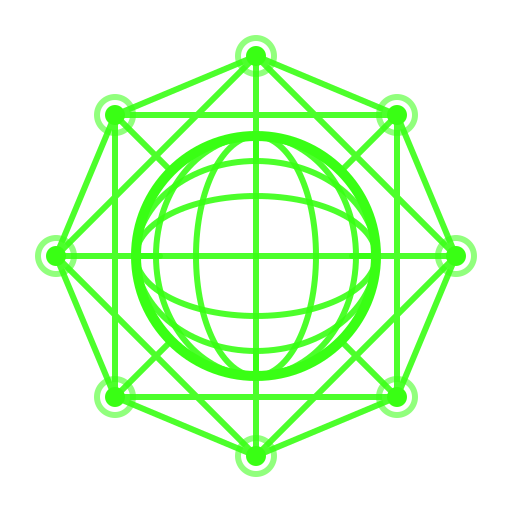

<div align="center">



# peernet

A peer-to-peer network node built on [libp2p](https://libp2p.io/).

Peers discover each other automatically via mDNS on the local network, organize into a Kademlia DHT for distributed key-value storage, and broadcast messages through gossipsub.

<a href="https://www.rust-lang.org/"></a>
<a href="https://github.com/libp2p/rust-libp2p"></a>
<a href="LICENSE"></a>

</div>

---

## What is this

peernet is a decentralized network where every node is equal. There is no central server. Nodes find each other, connect, and form a mesh that supports two core primitives:

- **Distributed hash table** — any node can store a key-value pair and any other node in the mesh can retrieve it. Records are replicated across peers using the Kademlia protocol, so data survives individual nodes going offline.
- **Pub/sub messaging** — nodes subscribe to topics and broadcast messages to all subscribers. Built on gossipsub, which propagates messages through the mesh efficiently without requiring direct connections between every pair of nodes.

Discovery is handled by mDNS, which means nodes on the same local network find each other without any configuration — no bootstrap nodes, no hardcoded addresses.

## Architecture

The project is split into three crates:

```
crates/
├── peernet-core      # Shared types, error definitions, command/event enums
├── peernet-network   # libp2p swarm, behaviour, event handlers, network actor
└── peernet           # CLI binary, user input handling, main loop
```

**peernet-core** defines the public contract: `NetworkCommand` (what the CLI can ask the network to do) and `NetworkEvent` (what the network reports back). All types are validated at construction through newtype wrappers (`DhtKey`, `DhtValue`, `TopicName`, `GossipPayload`).

**peernet-network** runs as an async actor. It owns the libp2p swarm and communicates with the outside world through channels. The caller gets a `NetworkHandle` to send commands and receive events — no direct access to the swarm.

**peernet** is the CLI that ties it all together. It reads user input, translates it into commands, and prints events as they come in.

## Usage

```
cargo run -p peernet
```

Or with a specific port:

```
cargo run -p peernet -- --port 4001
```

Once running, you'll see:

```
PEERNET
  PeerId:    12D3KooW...
  Listening: /ip4/0.0.0.0/tcp/4001

peernet>
```

Available commands:

```
send <message>       broadcast a message to all peers
put <key> <value>    store a key-value pair in the DHT
get <key>            retrieve a value from the DHT
quit                 exit
```

Start two or more nodes on the same network and they'll discover each other automatically.

## Tests

```
just test
```

Integration tests spin up real libp2p nodes that discover each other over mDNS and exercise the full protocol stack. They run serially to avoid mDNS interference between test nodes.

Other commands:

```
just check    # cargo check
just lint     # cargo clippy with -D warnings
just fmt      # cargo +nightly fmt
```
